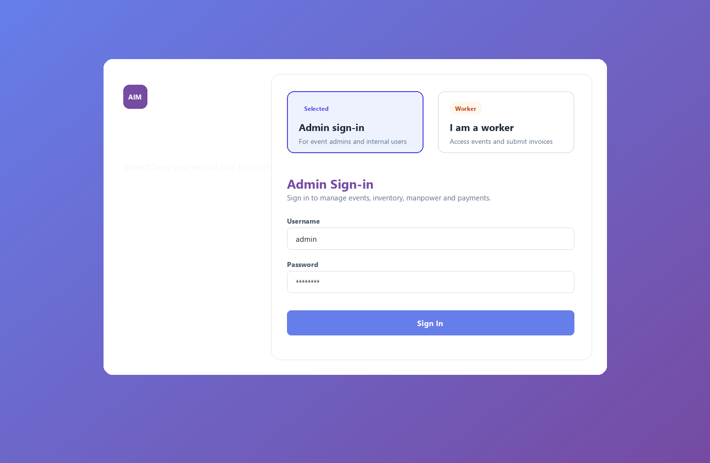
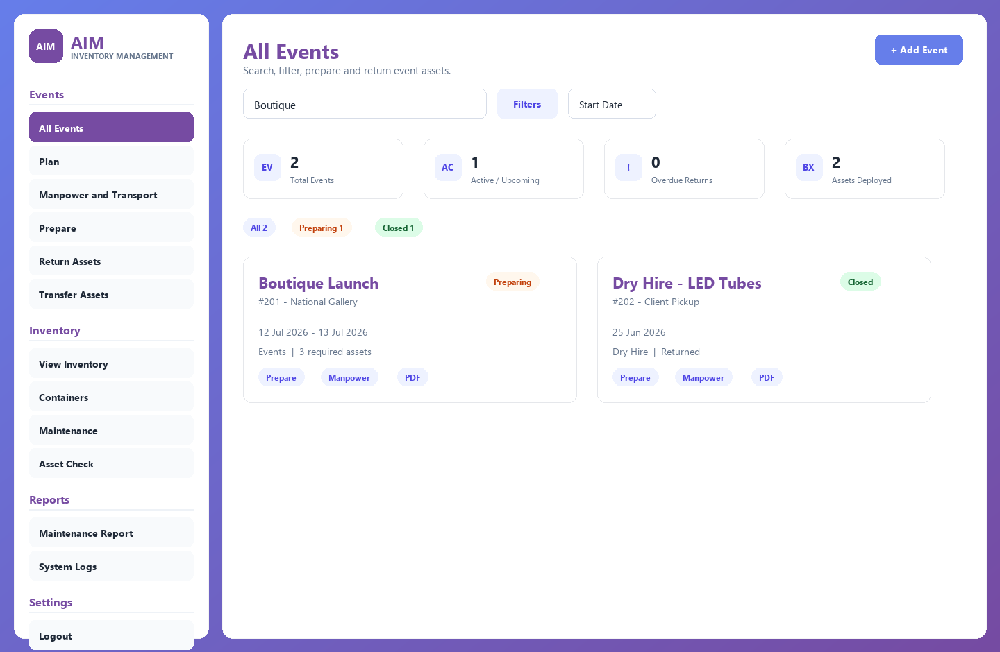
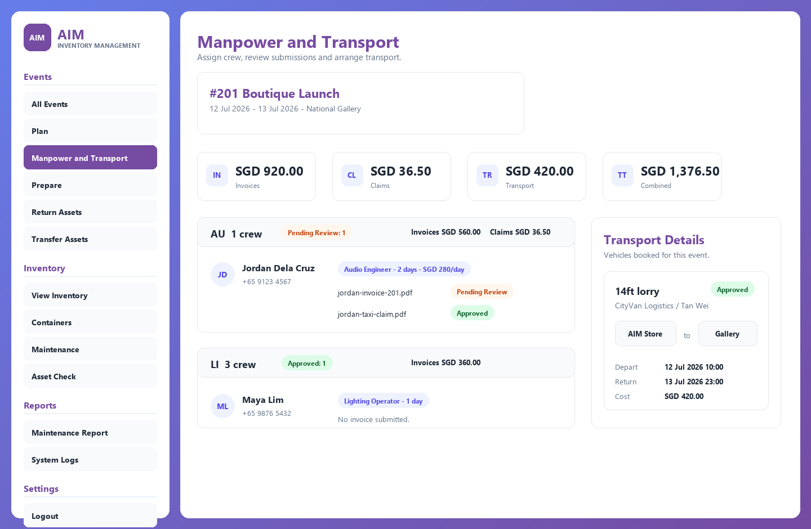
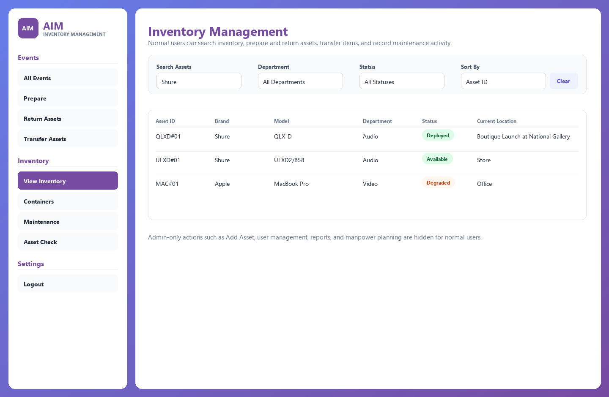
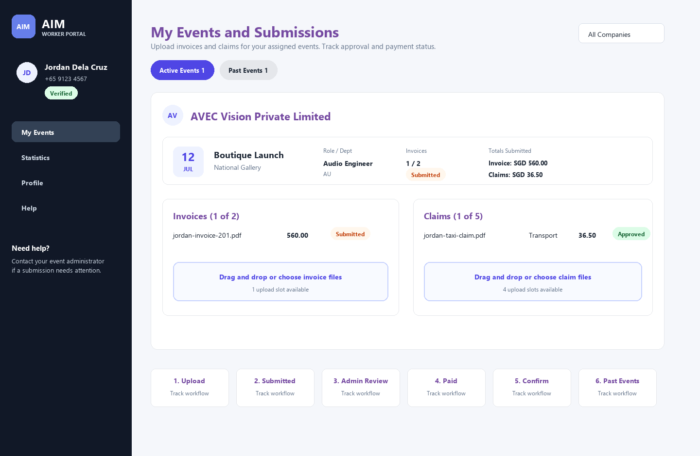

# Showbase User Manual

Last updated: July 6, 2026

This manual covers the three main ways people use Showbase: admins, normal internal users, and workers. The screenshots are representative captures of the current app layout and role flows.

## Sign In

Open Showbase and choose the correct access type.

- **Admin sign-in** is for internal users. Enter the username and password issued by an admin.
- **I am a worker** is for assigned freelancers, vendor personnel, and crew members submitting invoices or claims.
- If your worker phone number is not found, contact the company administrator so they can check your worker profile and assignment.

## Roles At A Glance

| Role | Main Access | Typical Tasks |
| --- | --- | --- |
| Admin | Full internal dashboard | Manage inventory, events, planning, manpower, transport, worker submissions, users, reports, and settings. |
| Normal user | Operational dashboard | View inventory/events, prepare assets, return assets, transfer assets, run asset checks, and record allowed maintenance activity. |
| Worker | Worker portal | View assigned events, upload invoices/claims, track approval, confirm payment receipt, and update worker profile details. |

Some admin tools may be limited to super admins, especially company-level setup and cross-company user assignment.

## Admin Guide

### Events Overview

Admins start from **All Events**, where they can search, filter, add events, switch views, and open event workflows.

Use this page to:

- Add a new event or dry hire.
- Search by event name, location, client, or event ID.
- Filter by type and state, such as New, Planning, Preparing, Ready, Ongoing, Returning, Overdue, or Closed.
- Open event actions such as details, planning, prepare, return, PDF/export, and manpower.
- Watch summary counts for total events, active/upcoming events, overdue returns, and deployed assets.

### Inventory Management

Admins can create and maintain asset records from **View Inventory**.

Common admin actions:

- Add new single or bulk assets.
- Edit brand, model, serial number, department, location, notes, and purchase/date fields.
- Mark assets available, deployed, missing, out of commission, degraded, or decommissioned.
- Add maintenance records with type, description, cost, and media where supported.
- Export inventory PDFs when needed.
- Manage containers and container maintenance history.

### Event Planning, Prepare, Return, And Transfer

Use event workflows to move assets through the event lifecycle.

- **Plan**: build or update event requirements, templates, department needs, and planned quantities.
- **Prepare**: assign specific physical assets to event requirements and mark collected custom assets.
- **Return Assets**: return event assets to their normal locations, close returns, and review overdue items.
- **Transfer Assets**: move assets between events, office/store, or other tracked locations.
- **Asset Check**: record sightings and identify missing or unverified items.

### Manpower And Transport

The **Manpower and Transport** page is admin-only. It connects event staffing, invoices, claims, transport bookings, and payment review.

Use this page to:

- Choose the event you are staffing.
- Add workers, vendors, and vendor personnel.
- Assign roles by department, work date, rate, and number of days.
- Review invoice and claim files submitted by workers.
- Approve, deny, or mark submissions paid.
- Add extra upload slots when a worker needs to replace or submit additional files.
- Create and manage transport profiles, saved pickup/drop-off locations, and event transport bookings.
- Download invoice or claim ZIP files for the event.

Recommended submission review flow:

1. Open the submitted invoice or claim.
2. Confirm the detected or entered amount.
3. For invoices, confirm department allocation.
4. Set the status to Approved, Denied, or Paid.
5. If denied, add a clear reason so the worker knows what to fix.

### Worker And User Administration

Admins can manage internal users and worker access.

- Create internal users and reset passwords.
- Activate or deactivate users.
- Grant or remove admin privileges where allowed.
- Reset a worker portal login if the worker forgot their PIN/password.
- Keep worker phone numbers current, since phone lookup is how workers access the portal.

### Reports And Settings

Admin-only areas include:

- **Maintenance Report**: review asset maintenance history and repair/fault records.
- **System Logs**: audit important app activity.
- **PDF Settings**: update company PDF branding and footer details.
- **Departments**: manage department codes, labels, and colors.
- **Company setup**: super-admin level company management where enabled.

## Normal User Guide

Normal users see a simpler internal dashboard. Admin-only menu items and destructive management actions are hidden.

Normal users can usually:

- View all events and inventory.
- Search, sort, and filter inventory.
- Prepare assigned event assets.
- Return assets after an event.
- Transfer assets between tracked locations.
- Add maintenance activity where permitted.
- Run asset checks and record sightings.

Normal users generally cannot:

- Add, edit, or delete inventory assets.
- Create, edit, delete, or force-close events.
- Access Plan, Manpower and Transport, Users, System Logs, PDF Settings, or admin reports.
- Delete files or records that require admin confirmation.

When in doubt, use the dashboard to perform the operational task. If a button or page is missing, it is probably admin-only.

## Worker Guide

Workers use the worker portal to submit invoices and claims for assigned events.

### First-Time Access

1. On the sign-in page, choose **I am a worker**.
2. Enter the phone number the company admin saved on your worker profile.
3. If this is your first time, create a PIN or password.
4. Continue to the worker portal.

### My Events

The **My Events** page shows active and past events.

For each event, workers can see:

- Event name, date, location, company, role, and department.
- Invoice upload slots.
- Claim upload slots.
- Current invoice and claim totals.
- Review and payment status.

### Uploading Invoices And Claims

- Invoices should be uploaded as PDF files.
- Claims may be PDF, PNG, JPG, or JPEG.
- Claims need amount, claim date, category, and optional notes.
- If an upload is denied, remove or replace it while it is still editable.
- Approved or paid submissions are locked.

### Status Meanings

| Status | Meaning |
| --- | --- |
| Uploading / Processing | The file is still being uploaded or scanned. |
| Submitted | The file has reached the admin review queue. |
| Details Required | More claim details are needed before review can continue. |
| Approved | The admin accepted the submission amount/details. |
| Denied | The admin rejected the submission. Check the reason and upload a replacement if needed. |
| Paid | The admin marked the submission as paid. |
| Payment Confirmed | The worker confirmed the payment was received. |

### Profile

Use **Profile** to update your phone number or change your PIN/password. You must enter your current PIN/password before saving changes.

### Past Events

Events move to **Past Events** after all payable submissions are paid and payment receipt is confirmed where required.

## Practical Tips

- Keep event names and locations specific so inventory movement is easy to audit.
- Use department codes consistently; they drive planning and manpower grouping.
- For workers, keep phone numbers current before the event starts.
- Deny submissions with clear reasons, such as missing amount, wrong event, duplicate invoice, or unreadable receipt.
- Review overdue returns regularly so deployed inventory does not stay assigned to finished events.
